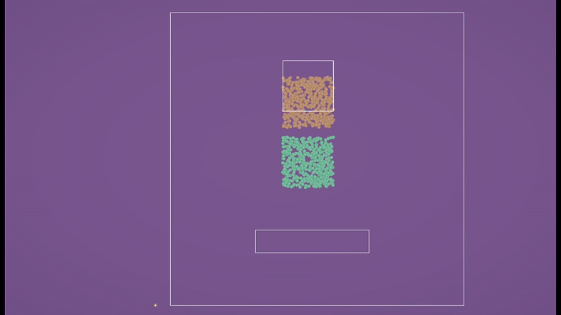

# ParTan

**ParTan** is a Unity port of the [PB-MPM (Point-Based Material Point Method)](https://github.com/electronicarts/pbmpm/tree/main) simulation developed by Electronic Arts.

This project reimplements the core logic of PB-MPM in Unity, targeting 2D particle-based physics simulations. It supports the following material types:
- **Liquid**
- **Viscous**
- **Elastic**
- **Sand**

## ⚙️ Unity Version

Developed with **Unity 6000.1.14f1**.

## 💻 Implementation Details

This repository contains **two separate implementations** of the simulation logic:

- **CPU Version**: Uses the Unity **Job System**.
- **GPU Version**: Uses a **Compute Shader** to run the simulation on the GPU.

## 📌 Notes

- This implementation is a **rough port** of the original logic from WGSL to Unity.  
- It is **not optimized** for performance or scalability.
- The purpose of this project is to **spare others from converting the WGSL code themselves**.
- Particle visualization is done using **Gizmos** in the Game view.
- **No dedicated renderer** is included.

## 🔗 Original Reference

This project is based on:  
👉 https://github.com/electronicarts/pbmpm/tree/main
